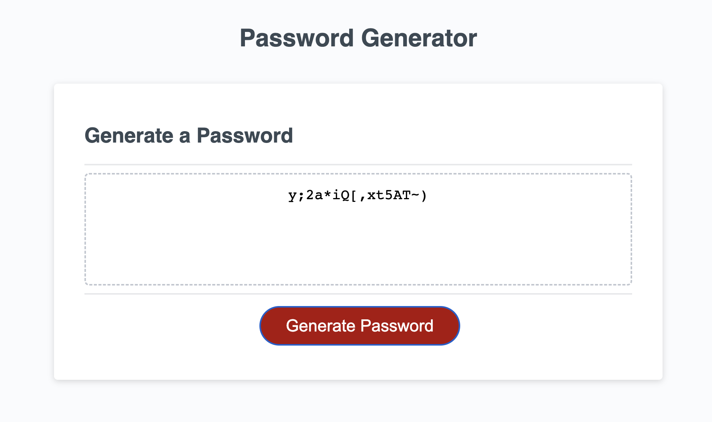

# Secure Random Password Generator

## Description

This project was created with the intention of providing an accessible, easy to use and secure random password generator, it generates all the data locally and doesn't send anything over to the internet.

It is perfect for anyone wanting a new secure password and is highly customizable so any user can choose their desired password based on their preferences.

## Usage

- 1st Clic the "Generate Password" button.
- 2nd Insert the desired password length (It must be at least 8 characters and maximum 128).
- 3rd Select wich type of characters you would like to use by typing "yes" or "no"
- 4th The new secure random password should be displayed on screen.

## Credits

Samuel Munguia
https://github.com/samuel-6

## License

MIT License

Copyright (c) [2023] [Samuel_Munguia_Espinosa]

Permission is hereby granted, free of charge, to any person obtaining a copy
of this software and associated documentation files (the "Software"), to deal
in the Software without restriction, including without limitation the rights
to use, copy, modify, merge, publish, distribute, sublicense, and/or sell
copies of the Software, and to permit persons to whom the Software is
furnished to do so, subject to the following conditions:

The above copyright notice and this permission notice shall be included in all
copies or substantial portions of the Software.

THE SOFTWARE IS PROVIDED "AS IS", WITHOUT WARRANTY OF ANY KIND, EXPRESS OR
IMPLIED, INCLUDING BUT NOT LIMITED TO THE WARRANTIES OF MERCHANTABILITY,
FITNESS FOR A PARTICULAR PURPOSE AND NONINFRINGEMENT. IN NO EVENT SHALL THE
AUTHORS OR COPYRIGHT HOLDERS BE LIABLE FOR ANY CLAIM, DAMAGES OR OTHER
LIABILITY, WHETHER IN AN ACTION OF CONTRACT, TORT OR OTHERWISE, ARISING FROM,
OUT OF OR IN CONNECTION WITH THE SOFTWARE OR THE USE OR OTHER DEALINGS IN THE
SOFTWARE.